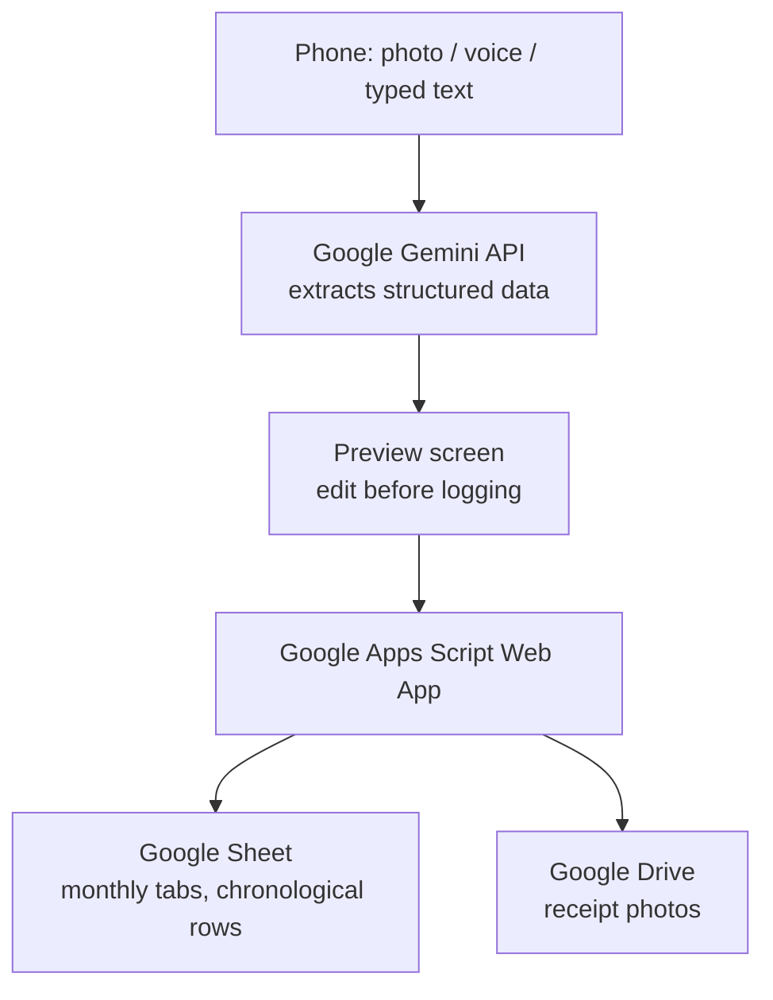

# Expense Tracker

A free, private, single-user expense-tracking Progressive Web App, installed on an Android phone's home screen. Log expenses by photo (receipt), voice note, or typed text; Google Gemini extracts the structured data, and a Google Apps Script backend writes it into an existing, formula-driven Google Sheet. No backend server, no third-party SaaS in the data path, no ongoing cost.

## Features

- **Three ways to log an expense:** take a photo of a receipt, attach a screenshot/gallery image, record a voice note (English or Arabic), or type it directly.
- **AI extraction:** Google Gemini (`gemini-2.5-flash`, free tier) reads the input and returns date, amount, description, category, and payment method.
- **Edit before logging:** every entry lands on a preview screen where all fields can be corrected before it's saved.
- **Raw Input trail:** the original receipt photo (as a Drive link) or the exact wording you typed/said is saved alongside every entry, so you can always check what the AI extracted it from.
- **Chronological logging:** entries are inserted into the correct date position in the sheet, not just appended, so logging a forgotten or backdated expense doesn't break the order.

## Architecture

- **`index.html`** (this repo): the entire app, a single-file PWA. Hosted on GitHub Pages and installed to the phone's home screen via Chrome. No build step.
- **Apps Script backend** (not in this repo, lives in the linked Google Sheet's own Apps Script project): routes each entry to the correct monthly sheet tab by date, inserts it in chronological order, and saves the Raw Input (Drive link or exact wording) into column G.
- **Google Sheet**: the existing formula-driven monthly expense template. Not version-controlled here; it's the user's own spreadsheet.

## Setup

1. **Google Sheet**: have your expense-tracking Sheet ready (12 monthly tabs, headers on row 39, entries starting row 41, columns B:F = Date/Amount/Description/Category/Method).
2. **Apps Script backend**: open the Sheet → Extensions → Apps Script, paste in the backend script, and deploy it as a Web App (Execute as: Me, Access: Anyone). Run the one-time `addRawInputHeaders()` function once to add the "Raw Input" header to every monthly tab.
3. **Gemini API key**: get a free key at [aistudio.google.com/apikey](https://aistudio.google.com/apikey).
4. **Open the app**: visit this repo's GitHub Pages URL in Chrome on Android, open Settings, and enter your Gemini API key and Apps Script Web App URL. Both are stored only in the phone's browser (`localStorage`), never in this repo.
5. **Add to home screen**: use Chrome's menu → "Add to Home screen" for one-tap access.

## Usage

Tap **Take a photo**, **Attach screenshot**, **Voice note**, or type into the text box and tap **Extract and preview**. Review the AI-extracted fields on the preview screen, correct anything, pick Cash/Visa, and tap **Log this expense**. It's written into the matching monthly tab in the right date position.

## Categories

Categories are hardcoded to match this project's own Masterlist tab (Baby!, Coffee Home, Coffee Out, Communications, Debt, Dry Cleaning, Entertainment, Food Dining Out, Food Take-Out/Snack, Food Work, Gifts, Groceries, Health/medical, Home, Personal, Transportation, Travel, Utilities, Water, zOther). Adding a category requires updating **two places** in `index.html` so they stay in sync: the `<select id="f-cat">` options and the `CATEGORIES` array in the `<script>` section, plus adding it to the Masterlist tab in the Sheet itself.

## Known limitations

- **Partial security headers on GitHub Pages.** Only the Content-Security-Policy survives (via a `<meta>` tag); `X-Frame-Options`, `Referrer-Policy`, and `Permissions-Policy` aren't settable on GitHub Pages and are not currently applied.
- **Settings don't sync or back up.** The Gemini API key and Apps Script URL live only in the phone's browser storage. Clearing browsing data, switching phones, or reinstalling requires re-entering them in Settings.
- **The Gemini model may need updating over time.** `GEMINI_MODEL` in `index.html` is currently `gemini-2.5-flash`. If a "model not found" error appears, check Google AI Studio's current free-tier model list and update the constant.
- **Silent write failures.** The client posts to the Apps Script backend with `mode: 'no-cors'`, so a failed write is not visible to the app; it always shows a success toast. Check the Sheet, or the Apps Script project's auto-created "Errors" tab, if an entry seems to be missing.
- **Not an installable PWA yet.** There's no `manifest.json` or service worker, so it works as a browser home-screen shortcut rather than a fully installable app (no offline caching, no custom install prompt). Deferred until the app grows enough to justify it.
- **Public repo.** Required for free GitHub Pages hosting. No secrets live in the code; the API key and Apps Script URL are only ever in the phone's local browser storage.

## Not yet built

- **Split-bill entries**: logging one purchase as multiple rows across different categories from a single voice/text/photo input. Discussed but not started; open design question is whether split amounts are stated explicitly or divided manually on the preview screen.
